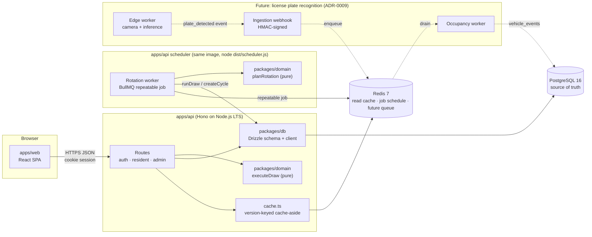
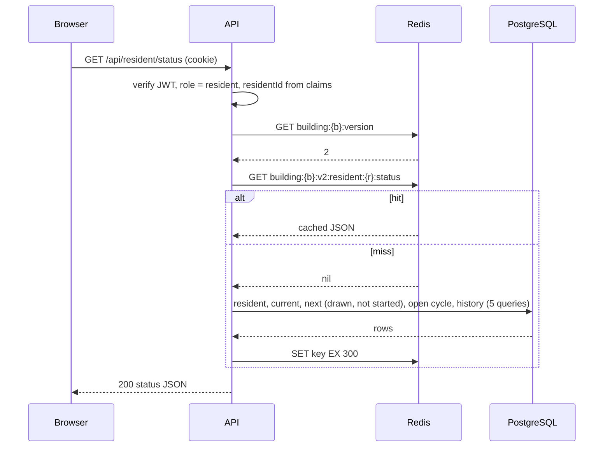
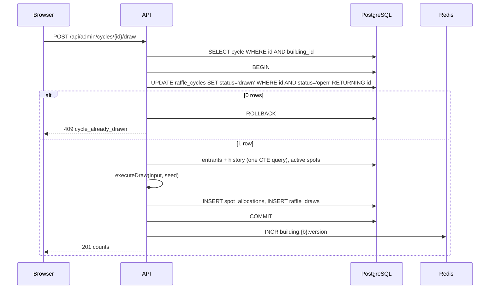
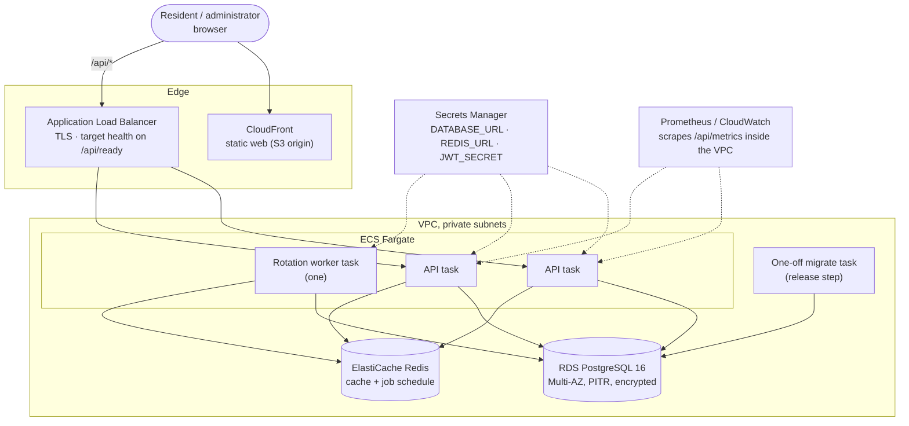

# Architecture

The system is a modular monolith: one API process, one PostgreSQL database, one Redis instance, and a static web client. Boundaries are kept at the package level (pnpm strict resolution plus `pnpm check:boundaries` in CI and before push) so that the parts most likely to change (the camera subsystem, the identity provider, the scheduler) attach at seams that already exist. Decisions with lasting consequences are recorded in [docs/adr](adr/README.md); this document shows how they fit together.

## System overview

Solid lines exist in the prototype. Dashed lines are the documented extension path; nothing in the current code depends on them. The rotation worker is the same container image as the API with a different entrypoint; it reuses the API's draw and cycle services, so a scheduled draw and a manual one are the same code path ([ADR-0012](adr/0012-rotation-worker-with-bullmq.md)).

### The most common request: a resident opens their status page

### The rare request: an administrator runs the draw

The cache call happens after `COMMIT`. No network round trip to Redis occurs while a database connection is held ([ADR-0004](adr/0004-draw-idempotency-via-cycle-state.md), [ADR-0005](adr/0005-redis-cache-aside-with-version-key.md)).

## Components and boundaries

| Package | Responsibility | May import | Must not import |
| --- | --- | --- | --- |
| `packages/domain` | The ranking rule and the draw as a pure function. Shared domain types. | Nothing from the workspace. No Node or browser APIs. | `db`, `api`, `web` |
| `packages/db` | Drizzle schema, constraints, migrations, client factory, migrator script. | `drizzle-orm`, `pg` | `domain`, `api`, `web` |
| `apps/api` | HTTP routes, session, authorization, cache, the draw transaction, seed fixture, and the rotation worker entrypoint (`src/scheduler`). | `domain`, `db` | `web` |
| `apps/web` | React client. | The API's exported route type only (`import type { AppType }`). | Anything at runtime from `api`, `db`, or `domain` |

These rules are enforced by `package.json` dependencies under pnpm's strict resolution: a package cannot import what it does not declare. The web app declares `@parking/api` for its types and gets compile-time checking of every request and response ([ADR-0006](adr/0006-hono-api-with-shared-types.md)).

Where the camera subsystem attaches: a new route module under `apps/api` for the webhook, a new table for vehicle events, and a worker process that shares `packages/db`. The allocation domain does not change ([ADR-0009](adr/0009-lpr-as-async-event-subsystem.md)).

## Data flow and consistency

- PostgreSQL is the only source of truth. Invariants are constraints: a spot allocated once per cycle, a registration wins at most once, a winner must be an entrant of that same cycle (composite foreign key), one open cycle per building (partial unique index). See [02-domain-and-fairness.md](02-domain-and-fairness.md).
- The draw's idempotency is a state transition inside the same transaction as the writes. Retries are safe by construction.
- Redis accelerates one read path and is never consulted for a decision. If it is down, the API logs once and serves from PostgreSQL. If it is wiped, no allocation data is lost: cached reads rebuild from PostgreSQL, and the worker re-registers its schedule when it starts (`pnpm scheduler --once` runs the check immediately).
- Every write that changes what residents see bumps the building version after commit, so a resident refreshing right after a draw sees the result. Between the commit and the bump there is a window of milliseconds where a read may cache stale data under the old version; the next bump makes that key unreachable, and the 300 second TTL bounds it in any case.

## Scaling path

Draw volume never needs to scale: four draws per building per year is not a throughput problem at any realistic number of buildings, and one draw costs one aggregate query over the building's history plus an in-memory sort (the cost is stated in [02-domain-and-fairness.md](02-domain-and-fairness.md)). What scales is read traffic right after a draw is announced, and the number of tenants sharing one deployment.

| Stage | What changes | What does not |
| --- | --- | --- |
| One building (today) | Single API instance, one PostgreSQL, one Redis. Docker Compose locally. | |
| Many buildings, one operator | `building_id` is on the tenant roots (`residents`, `users`, `parking_spots`, `raffle_cycles`); registrations, allocations, and draws belong to a building through their cycle, and every admin and resident query is scoped by the session's building. Same-building ownership of a registration or an allocation (the cycle of one building, the resident or spot of another) is enforced by those scoped services, not by a constraint: the schema has per-column foreign keys, not composite same-building ones. Add Row-Level Security: direct policies on the root tables, join-based policies (through `raffle_cycles`) on the three child tables, or a denormalized `building_id` with composite foreign keys if policy performance requires it; either closes that gap at the database. Run two or more API instances behind a load balancer; the API is stateless (session in cookie). Add a connection pooler (PgBouncer, transaction mode) once instance count times pool size approaches PostgreSQL's connection limit. | Schema, domain code, cache scheme (already keyed per building). |
| Many operators | Choose between shared schema with RLS (cheapest), schema per tenant (stronger isolation, same instance), or database per tenant (regulatory isolation). The code path is identical; the connection string becomes tenant-resolved. | Domain, API, web. |
| Camera telemetry | Bursts land on the Redis queue, a separate worker drains them. Add read replicas only if the occupancy dashboard becomes read-heavy; the allocation path never needs them. | The draw and the resident status path. |

Row-Level Security is the single most valuable hardening step and is deferred, not skipped: at one building it adds policy management without protecting anything the `building_id` scoping does not already protect.

## Deployment

### Reference deployment

One API image serves three roles: API tasks, the single worker task, and the one-off migration task. Nothing in the VPC is reachable from the internet except through the load balancer, and `/api/metrics` is not routed by it.

### Local prototype versus reference cloud topology

The prototype runs on Docker Compose. The reference topology below is the intended production shape on AWS; the equivalents on GCP or Azure are one-to-one (Cloud Run or Container Apps, Cloud SQL or Azure Database, Memorystore or Azure Cache). Nothing in the code is provider-specific.

| Concern | Local prototype | Reference production |
| --- | --- | --- |
| API runtime | `tsx watch` in a terminal | `apps/api/Dockerfile`: `tsup` single-file bundle on `node:24-alpine`, non-root, on ECS Fargate, 2+ tasks across availability zones |
| Web | Vite dev server with `/api` proxy | Static build in S3 behind CloudFront with `/api/*` routed to the ALB; `apps/web/Dockerfile` (unprivileged nginx, security headers, `/api/metrics` blocked at the edge) is the equivalent for container-only platforms |
| Entry point | `localhost:5173` | Application Load Balancer, TLS termination, target health on `/api/ready`; `/api/metrics` not routed |
| Database | `postgres:16-alpine` container | RDS for PostgreSQL 16, Multi-AZ, automated backups, point-in-time recovery, encryption at rest |
| Cache and queue | `redis:7-alpine` container | ElastiCache for Redis, single node is enough; loss is tolerated by design |
| Secrets | `.env` file (git-ignored) | Secrets Manager injected as task environment; `JWT_SECRET` rotated by redeploy |
| Migrations | `pnpm db:migrate` by hand | One-off ECS task running the same migrator before the new API task set is promoted; a failed migration fails the deploy, not the service |
| Identity | Password-less mock login | OIDC provider (Cognito, Auth0, or Keycloak) issuing the same session cookie ([ADR-0008](adr/0008-mock-auth-jwt-cookie-rbac.md)) |
| Scheduler | `pnpm scheduler` (worker) or `pnpm scheduler --once` | Same API image with `node dist/scheduler.js` as a one-task ECS service; BullMQ repeatable job on ElastiCache. Or `--once` from EventBridge Scheduler ([ADR-0012](adr/0012-rotation-worker-with-bullmq.md)) |
| Infrastructure as code | Docker Compose file | Terraform, one module per environment, state in S3 with locking |

### Environments

Local, staging, production. Staging mirrors production topology at the smallest instance sizes and is where camera fixtures are replayed before any hardware is installed. Promotion is by image tag; the same image runs in staging and production.

### Why not serverless

The API holds a PostgreSQL connection pool and, later, a long-lived queue consumer. Both fit a small always-on container better than a function per request, and the traffic profile (a few hundred residents, quarterly peaks) does not need scale-to-zero economics. Hono runs unchanged on Lambda if that assessment changes.
