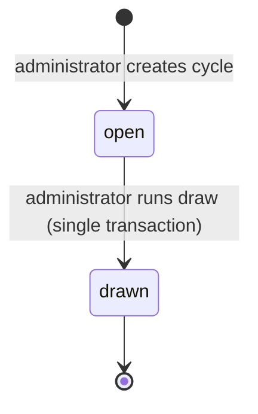
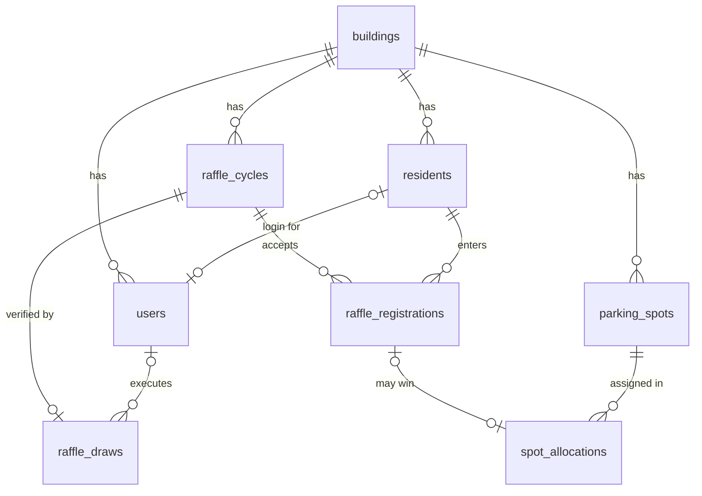

# Domain model and fairness

This document explains the allocation rule the way it should be explained to a resident, then documents the data model that makes the rule enforceable. The rule itself is decided in [ADR-0003](adr/0003-fairness-ranking-rule.md); the implementation is `executeDraw` in `packages/domain/src/draw.ts`.

## Vocabulary

Same words in code, documentation, and the user interface.

| Term | Meaning |
| --- | --- |
| Building | The tenant. Every resident, spot, and cycle belongs to exactly one. |
| Resident | A household member eligible to enter draws. Identified by unit. Keeps history after moving out; cannot register after `moved_out_at` is set. |
| Spot | A physical parking space. Can be deactivated; existing allocations are untouched, future draws skip it. |
| Cycle | One quarter. Has a per-building `sequence` (1, 2, 3, ...), a period (`starts_on`, `ends_on`), and a status. |
| Registration | A resident's entry into one cycle's draw. At most one per resident per cycle. |
| Allocation | A registration that won a spot in its cycle. The allocations table is the history. |
| Draw | The single event that turns a cycle's registrations into allocations. Recorded once per cycle with its seed and input. |

## Cycle lifecycle

Two states are enough. Registration is allowed while `open`. The draw flips the status and writes allocations in the same transaction, so there is never a visible intermediate state ([ADR-0004](adr/0004-draw-idempotency-via-cycle-state.md)).

- The **current** cycle for a resident is the drawn cycle whose period contains today. Their spot, if any, is the allocation in that cycle.
- The **next** cycle is the building's open cycle. A partial unique index guarantees there is at most one.
- Periods are calendar dates in UTC. Building-local time zones are a known simplification (see limits below).

## The ranking rule, explained for residents

The draw is not a lottery. It is a sorted list. Everyone who registered is ordered by four keys, and the first N people get spots, where N is the number of active spots.

1. **Longest wait first.** How many cycles since you last had a spot. Never had one? You go to the front.
2. **Fewest spots ever.** Among equal waits, whoever has had fewer spots over their whole history goes first.
3. **Most attempts.** Among ties on both, whoever has entered and lost more often goes first.
4. **A coin flip you can check.** Remaining ties are broken by a random value derived from the draw's seed and your registration id.

One sentence: longest wait first, then fewest wins, then most attempts, then a seeded coin flip.

Rotation follows from rule 1 without a special case. If you held a spot last quarter, your wait is 1, the smallest possible, so you are behind everyone who has waited longer. When there are more spots than entrants, everyone gets one, including you; there is no scarcity to arbitrate.

### A real draw, step by step

The development fixture (`pnpm db:seed`) is deterministic: seeds and ids are pinned, so the numbers below are identical on every machine. Cycle 2 had ten entrants for four spots.

| Unit | History before cycle 2 | Wait | Wins | Attempts without a spot | Rank | Spot |
| --- | --- | --- | --- | --- | --- | --- |
| 201 | Entered cycle 1, lost | never | 0 | 1 | 1 | P4 |
| 101 | Entered cycle 1, lost | never | 0 | 1 | 2 | P1 |
| 104 | Entered cycle 1, lost | never | 0 | 1 | 3 | P3 |
| 302 | First entry | never | 0 | 0 | 4 | P2 |
| 303 | First entry | never | 0 | 0 | – | none |
| 304 | First entry | never | 0 | 0 | – | none |
| 102 | Won cycle 1 (P3) | 1 | 1 | 0 | – | none |
| 103 | Won cycle 1 (P1) | 1 | 1 | 0 | – | none |
| 202 | Won cycle 1 (P2) | 1 | 1 | 0 | – | none |
| 301 | Won cycle 1 (P4) | 1 | 1 | 0 | – | none |

Reading it:

- Rule 1 splits the field. Six residents have never had a spot; four held one last quarter. All six never-allocated residents rank above all four holders, however the rest falls.
- Rule 2 does not separate anyone here: every never-allocated resident has zero wins, every holder has one.
- Rule 3 orders the six. Units 201, 101, and 104 entered cycle 1 and lost, so they have one attempt without a spot; units 302, 303, and 304 are entering for the first time. Persistence wins: the three previous losers take ranks 1 to 3.
- Rule 4 decides the last spot. 302, 303, and 304 are a complete tie on the first three rules. The seeded tie-break gave the fourth spot to 302. With a different seed it could have been 303 or 304; with this seed it is always 302.
- The four holders from cycle 1 rank last. Wait 1 is the smallest possible value. With four spots and six residents ahead of them, none of them gets a spot this quarter.

What happens next is also predictable. Cycle 3 is open with six entrants: 101 and 302 hold spots now (wait 1), 102, 103, and 202 held spots in cycle 1 (wait 2, one attempt without a spot each), and 203 has never had a spot. When the administrator runs the draw, 203 ranks first and 102, 103, and 202 fill the remaining three spots in an order decided by the seed; 101 and 302 go without. If unit 104 registers before the draw, they rank with 101 and 302 and also go without, because they hold a spot this quarter.

The rule is covered by unit tests in `packages/domain/src/draw.test.ts` (15 cases, including "puts a never-allocated resident ahead of last quarter's winner" and "ranks fewer lifetime wins first when the wait is equal", which exercises rule 2) and by the integration test "ranks a never-allocated resident above last cycle's winner in the next cycle" in `apps/api/src/admin/draw.test.ts`, which runs two consecutive draws against PostgreSQL.

### How a resident can verify a draw

Every draw stores its seed and the exact input (entrants with their three history numbers, and the active spots) in `raffle_draws`. The administrator screen shows the seed. Given that record, anyone can run `executeDraw` and reproduce the allocations byte for byte; the integration test "allocates min(spots, entrants) and stores a replayable verification record" does exactly this. The function is pure and does not depend on the order entrants are supplied in, so the replay cannot be gamed by reordering.

The seed is generated with `crypto.randomBytes` at draw time, so nobody can predict tie-breaks before the draw, and it is recorded, so nobody can dispute them after.

## Data model

Schema: `packages/db/src/schema.ts`. Migration: `packages/db/drizzle/0000_initial_schema.sql`.

### Constraints and the invariant each one enforces

| Constraint | Invariant |
| --- | --- |
| `spot_allocations` UNIQUE `(cycle_id, spot_id)` | A spot is allocated at most once per cycle. |
| `spot_allocations` UNIQUE `(registration_id)` | A registration wins at most once. |
| `spot_allocations` FK `(registration_id, cycle_id)` → `raffle_registrations (id, cycle_id)` | A winner must have registered for that same cycle. An allocation cannot point at a registration from another cycle. |
| `spot_allocations` UNIQUE `(cycle_id, rank)` | Ranks within a draw are distinct, so the published order is unambiguous. |
| `raffle_registrations` UNIQUE `(cycle_id, resident_id)` | One entry per resident per cycle. |
| `raffle_cycles` UNIQUE `(building_id, sequence)` | Cycle distances used by the ranking rule are well defined. |
| `raffle_cycles` partial UNIQUE `(building_id) WHERE status = 'open'` | At most one cycle accepts registrations per building. |
| `raffle_cycles` CHECK `ends_on > starts_on`, `sequence > 0` | Periods and sequences are sane. |
| `raffle_draws` UNIQUE `(cycle_id)` | One verification record per cycle. |
| `users` CHECK `role = 'admin' OR resident_id IS NOT NULL` | A resident login is always linked to a resident. |
| `users` UNIQUE `(email)`, UNIQUE `(resident_id)` | One login per email, one login per resident. |
| `residents` UNIQUE `(building_id, email)` | No duplicate residents within a building. |
| `parking_spots` UNIQUE `(building_id, label)` | Spot labels are unambiguous within a building. |

Uniqueness is declared as table constraints rather than unique indexes so that they exist inside `CREATE TABLE`, before the composite foreign key that depends on one of them is added. The one partial uniqueness rule must be an index, because PostgreSQL has no partial unique constraint.

### Why history is not a separate table

The ranking rule needs three numbers per entrant: cycles since last allocation, lifetime allocations, and unsuccessful registrations. All three are aggregates over `raffle_registrations` left-joined to `spot_allocations` and `raffle_cycles`. Keeping a denormalized history or counters would introduce a second source of truth that could drift from the allocations; computing them in one query at draw time is cheap (a few hundred rows per building) and cannot be wrong. The query is `loadEntrants` in `apps/api/src/admin/draw.ts`.

### Indexes and the queries that use them

| Index | Query |
| --- | --- |
| `raffle_registrations (resident_id)` | Resident status and history; a resident's entries across cycles. |
| `raffle_registrations (cycle_id, resident_id)` (from the unique constraint) | "Is this resident registered for the open cycle"; all entrants of a cycle. |
| `spot_allocations (cycle_id, spot_id)` (from the unique constraint) | All allocations of a cycle for the administrator results screen. |
| `spot_allocations (registration_id)` (from the unique constraint) | Join from registration to allocation in history and ranking queries. |
| `raffle_cycles (building_id, sequence)` (from the unique constraint) | Listing cycles, next sequence number. |
| `raffle_cycles (building_id) WHERE status = 'open'` | Finding the open cycle, which happens on every status read. |

No additional indexes are planned until a query plan shows a need. At the data volumes of a residential building every table fits in memory.

## Known limits and planned extensions

- **Spot preference and accessibility.** The rule assigns spots to winners in a seeded order, so no spot is systematically given to the top rank. It does not know that some residents need an accessible spot or that some spots are better. The first extension is a reserved-spot rule that runs before the general draw: residents flagged as needing an accessible spot are ranked by the same four keys among accessible spots, then everyone else is ranked among the remaining spots. The ranking rule does not change; it runs twice on partitioned inputs.
- **Households with more than one vehicle.** Out of scope. Modeling it means a `vehicles` table and a decision about whether a household can hold two spots in one cycle. That decision belongs to building rules, not to code, so it is deliberately left open.
- **Mid-cycle move-outs.** A resident who moves out keeps their history and cannot register. Their current allocation stays until the cycle ends. Releasing a spot mid-cycle and reassigning it (to the next ranked entrant of that draw, using the stored ranking) is a small, well-defined follow-up.
- **Time zones.** Dates are compared in UTC. A building in UTC-6 could see its cycle start a few hours late on the boundary day. The fix is a `timezone` column on `buildings` and computing "today" per building.
- **Quarter alignment.** The system does not force cycles onto calendar quarters. The administrator picks the period; the seed fixture uses calendar quarters because that is what the brief describes.
