# Planning and delegation

Written in first person because the brief asks what I would keep and what I would delegate.

## Work breakdown

The prototype was built in the order below. Status reflects what exists on `main`.

| Module | Owner | Depends on | Definition of done | Status |
| --- | --- | --- | --- | --- |
| Domain engine (`packages/domain`) | Me | Nothing | Pure `executeDraw`; unit tests for every ranking rule, tie-break determinism, and input validation | Done, 15 tests |
| Schema and migrations (`packages/db`) | Me | Nothing | Every uniqueness and ownership invariant is a constraint (registration closure is a row lock shared with the draw); migration applies to a fresh database; migrator script | Done |
| Draw transaction (`apps/api/src/admin/draw.ts`) | Me | Domain, schema | Single transaction, state-transition mutex, verification record; integration tests for replay, 409, concurrency, tenant scoping | Done, 5 tests |
| Session and authorization (`apps/api/src/auth`) | Me | Nothing | JWT cookie, role middleware, CSRF header check; resident id only from claims | Done |
| Resident routes and status query | Delegable | Schema, auth | Status shape agreed with web; register handles 409s; cache bump after write | Done |
| Admin routes (cycles, spots) | Delegable | Schema, auth | Cycle list, create, detail, draw, verification; spot list, create, activate/deactivate; all scoped by building; 409 on partial unique violation | Done |
| Cache adapter (`apps/api/src/cache.ts`) | Delegable | Nothing | `Cache` interface, Redis and null implementations, degrade on failure | Done |
| Web: sign-in and resident view | Delegable | API types (or mocks) | Status, register, history; keyboard reachable; error states | Done |
| Web: admin view | Delegable | API types (or mocks) | Cycles, draw confirmation dialog, results with seed, spots | Done |
| Seed fixture | Delegable | Draw service | Two drawn quarters through the real service, one open | Done |
| CI | Delegable | Nothing | Lint, typecheck, migrate, test against services, build | Done |
| Documentation | Me, with review from the team | Everything | Another engineer can run, extend, and explain the system | This folder |
| Withdraw registration | Junior (starter task) | Resident routes | See [06-team-and-communication.md](06-team-and-communication.md) | Open, by design |
| Rotation worker (`apps/api/src/scheduler`) | Me | Draw service, Redis | Policy is a pure, unit-tested function; worker reuses the draw and cycle services; integration tests for draw-then-open and idempotency; `--once` mode ([ADR-0012](adr/0012-rotation-worker-with-bullmq.md)) | Done |
| Identity provider | Delegable | Deployment target | OIDC callback issues the existing cookie | Deferred |
| Row-Level Security | Me | Multi-building need | Policies per tenant table; tests that a missing `WHERE` cannot leak | Deferred |
| License plate recognition | Split, see below | Event contract | Below | Planned |

### Critical path and how the work parallelizes

The schema and the domain engine are the critical path: everything else consumes their types. Both were done first and are the two pieces I would never hand off in the first iteration, because they encode the invariants.

Everything downstream parallelizes with a mock-first approach. The API's route types are the contract; the web app compiles against them. On day one I commit the route signatures with stub handlers returning fixture data, so the web work starts before the queries exist. The `Cache` interface exists so the Redis adapter and the routes that use it can be written by different people at the same time. The seed fixture is what makes review of the web work possible without a manual setup.

## What I keep and what I delegate

The rule: I keep what encodes an invariant or a contract other people depend on. I delegate what has a clear interface and a testable definition of done.

**Keep**

- The ranking rule and the domain engine. Changing it is a policy decision with resident-facing consequences.
- The schema and every migration. Constraints are the last line of defense; I review each one.
- The draw transaction. Concurrency mistakes here are silent until a resident complains.
- Authentication and authorization middleware. Ownership checks are the most common real-world bug class.
- Event contracts for external systems (cameras, identity provider).

**Delegate**

- Web views against the typed client or against mocks.
- Cache adapters behind the `Cache` interface.
- Admin routes (cycle and spot management), with the building-scoping pattern already established in the first route.
- CI pipeline, seed data, fixtures.
- Endpoint documentation generated from route definitions.
- Anything with a clear "done" that a reviewer can verify from a test.

## License plate recognition: delegation plan

The brief asks for real-time vehicle detection as a future capability. It is a large feature with three specialties (computer vision, edge hardware, real-time UI) that the core team does not need to have. The design goal is that each specialty can be delivered by a different person against one contract, and that nothing about it touches the allocation domain ([ADR-0009](adr/0009-lpr-as-async-event-subsystem.md)).

```mermaid
flowchart LR
  cam["IP camera<br/>RTSP stream"] --> edge["Edge worker<br/>capture + inference"]
  edge -- "POST /api/lpr/events<br/>HMAC-signed JSON" --> hook["Ingestion webhook<br/>(API)"]
  hook -- enqueue --> q[("Redis queue")]
  q -- drain --> w["Occupancy worker"]
  w -- "vehicle_events,<br/>spot occupancy" --> pg[("PostgreSQL")]
  pg -- "change" --> sse["SSE endpoint"]
  sse --> ui["Resident and admin UI"]

  classDef keep fill:#e2e8f0,stroke:#334155
  classDef delegate fill:#fff,stroke:#94a3b8,stroke-dasharray: 4 3
  class hook,q,w,pg keep
  class cam,edge,sse,ui delegate
```

Shaded: I own. Dashed: delegated against the contract.

Each stream is a GitHub issue under the milestone [License plate recognition](https://github.com/marcoamtz/residential-parking-system/milestone/1): [#6](https://github.com/marcoamtz/residential-parking-system/issues/6) contract and fixtures, [#7](https://github.com/marcoamtz/residential-parking-system/issues/7) ingestion webhook, [#8](https://github.com/marcoamtz/residential-parking-system/issues/8) persistence and occupancy (kept); [#9](https://github.com/marcoamtz/residential-parking-system/issues/9) edge pipeline, [#10](https://github.com/marcoamtz/residential-parking-system/issues/10) edge hardware, [#11](https://github.com/marcoamtz/residential-parking-system/issues/11) live UI (delegated). Labels `owner:*` show who holds each one.

### The boundary

| Workstream | Owner | Deliverable | Definition of done |
| --- | --- | --- | --- |
| Event contract | Me | Versioned JSON schema: `camera_id`, `plate`, `direction` (`enter`/`exit`), `captured_at`, `confidence`, `evidence_ref`. Published as a Zod schema in `packages/domain` and as JSON Schema for non-TypeScript producers. | Recorded fixture files exist; both producer and consumer tests validate against them. |
| Ingestion webhook | Me | `POST /api/lpr/events` with per-camera shared secret, HMAC-SHA256 over the raw body, replay protection by timestamp window, rate limiting, `202 Accepted` after enqueue. | Integration test: valid signature accepted, tampered body rejected, stale timestamp rejected, burst of 500 events acknowledged in under a second. |
| Persistence and occupancy model | Me | `vehicle_events` table, `vehicles` table linking plates (encrypted at the column level) to residents, spot occupancy state machine (`vacant`, `occupied_by_holder`, `occupied_by_other`, `unknown`). | Migration applies; state machine unit-tested; unmatched plates land in a review queue for the administrator. |
| Edge capture and inference | ML engineer | Container that reads RTSP, detects plates, runs recognition (YOLO-family detector plus an OCR or ALPR model), emits contract events. Owns model selection and, if off-the-shelf models miss the agreed targets on the fixture set, a time-boxed adaptation (fine-tuning on recorded frames, or a vendor ALPR SDK); the decision to fund training beyond that time box is mine, recorded in an ADR. | Against the recorded fixture video set: precision and recall targets agreed up front, latency under 2 seconds from frame to event on the target hardware. Emits events that pass the contract validator. |
| Edge hardware and network | IoT / DevOps engineer | Device selection (Jetson-class or equivalent), isolated camera VLAN, outbound-only connectivity, watchdog and auto-restart, remote log shipping. | Device recovers unattended from power loss and network loss; secrets provisioned per device; no inbound ports. |
| Live UI | Front-end developer | Server-sent events subscription in the web app; occupancy shown on the resident's spot card and on an administrator floor list. | Reconnects after network loss; no polling; accessible status announcements. |

### Sequencing

1. **Contract and fixtures.** I publish the schema and a set of recorded events (including malformed ones). Nothing else starts before this exists.
2. **Webhook with replay.** I ship the ingestion endpoint and a small CLI that replays fixture files at it. The worker and occupancy model follow. At this point the whole server side is testable with zero hardware.
3. **Pipeline against fixtures.** The ML engineer develops against recorded video and validates output with the contract validator, independently of the server.
4. **One camera in staging.** IoT brings one device online against staging. First real end-to-end event. Precision and recall measured against ground truth for a week.
5. **UI and rollout.** The front-end developer wires SSE once staging emits real events. Rollout building by building, unmatched-plate review queue watched by the administrator.

### How the team collaborates

- **Contract first, then parallel.** The schema is the meeting point. Changes to it go through an ADR and a version bump; producers and consumers pin a version.
- **Shared fixtures.** Recorded events and recorded video are checked in (or stored in an artifact bucket with a manifest). Every stream tests against the same files, so "works on my camera" cannot happen.
- **Weekly integration check.** Thirty minutes, staging environment, replay the fixtures end to end and look at one real camera. Blockers surface here, not at rollout.
- **Definition of done per stream.** Written in the table above before work starts. Review is against it, not against opinion.
- **What I review personally.** The contract, the webhook, migrations, and anything touching resident data. Everything else is reviewed by the stream owner's peer.

## Estimates and risks

Sizing in ideal engineering days, assuming one person per stream and the staging environment available. These are planning numbers, not commitments.

| Stream | Ideal days | Main assumption |
| --- | --- | --- |
| Contract, fixtures, webhook, worker, occupancy model | 8 | No vendor-specific camera payloads in the first iteration |
| Edge capture and inference | 15 | An off-the-shelf detector and recognizer reach the agreed accuracy on the fixture set |
| Model adaptation, if needed | 10, time-boxed | Fine-tuning on recorded frames or a vendor SDK; triggered only if the row above misses its targets; owned by the ML engineer, funded by my decision |
| Edge hardware and network | 6 | One building, one to four cameras, existing network with VLAN capability |
| Live UI | 4 | SSE, no WebSocket infrastructure needed |
| Integration and rollout | 5 | One week of measurement in staging before the first building |

Top risks and mitigations:

1. **Fairness disputes.** A resident believes the draw was unfair. Mitigation: the rule is one sentence, published in the app; every draw is replayable from its stored seed and input. This is already built.
2. **Camera vendor payload variance.** A future camera vendor posts its own JSON. Mitigation: an adapter per vendor translates into the contract at the edge; the server accepts one shape only.
3. **Recognition accuracy in bad conditions.** Night, rain, dirty plates. Mitigation: `confidence` is in the contract, low-confidence events go to the review queue instead of changing occupancy state, and precision and recall targets are agreed before hardware is bought.
4. **Scope creep on the administrator UI.** Mitigation: the out-of-scope list in [00-prototype-scope.md](00-prototype-scope.md) is explicit and additions require a written reason.
